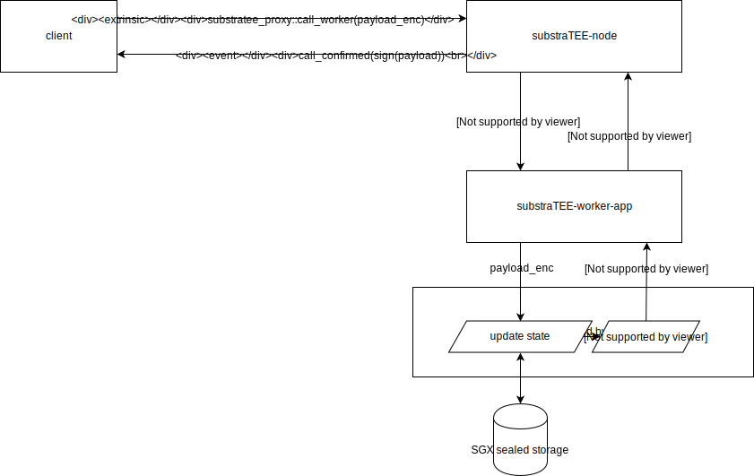

# substraTEE

[substrate](https://docs.substrate.dev/) runtime in Trusted Execution Environment

*substraTEE* is an extension to [Parity Substrate](https://docs.substrate.dev/), allowing to call a custom state transition function inside a Trusted Execution Environment (TEE), namely an Intel SGX enclave thereby providing confidentiality and integrity. The enclaves operate on an encrypted state which can be read and written only by a set of provisioned and remote-attested enclaves.
*substraTEE* enables use cases demanding transaction privacy as well as atomic cross-chain transfers (bridges).

## Concept Study

Different use cases for TEE's and potential software architectures have been analyzed and compared in [CONCEPTS](./CONCEPTS.md).
In the following we'll refer to the *substraTEE-worker* architecture, which has been implemented because it supports the widest range of use cases.

## Overview

The high level architecture of the current implementation can be seen in the following diagram:

The main building blocks can be found in the following repositories:

* [substraTEE-node](https://github.com/scs/substraTEE-node): (custom substrate node) A substrate node with a custom runtime module
* [substraTEE-worker](https://github.com/scs/substraTEE-worker) (client, worker-app, worker-enclave): A SGX-enabled service that performs a confidential state-transition-function

## Demo

This repo will host a docker container to showcase basic functionality soon.

## Acknowledgements

The development of substraTEE is financed by [web3 foundation](https://web3.foundation/)'s grant programme.

We also thank the teams at

* [Parity Technologies](https://www.parity.io/) for building [substrate](https://github.com/paritytech/substrate) and supporting us during development.
* [Baidu's Rust-SGX-SDK](https://github.com/baidu/rust-sgx-sdk) for their very helpful support and contributions.